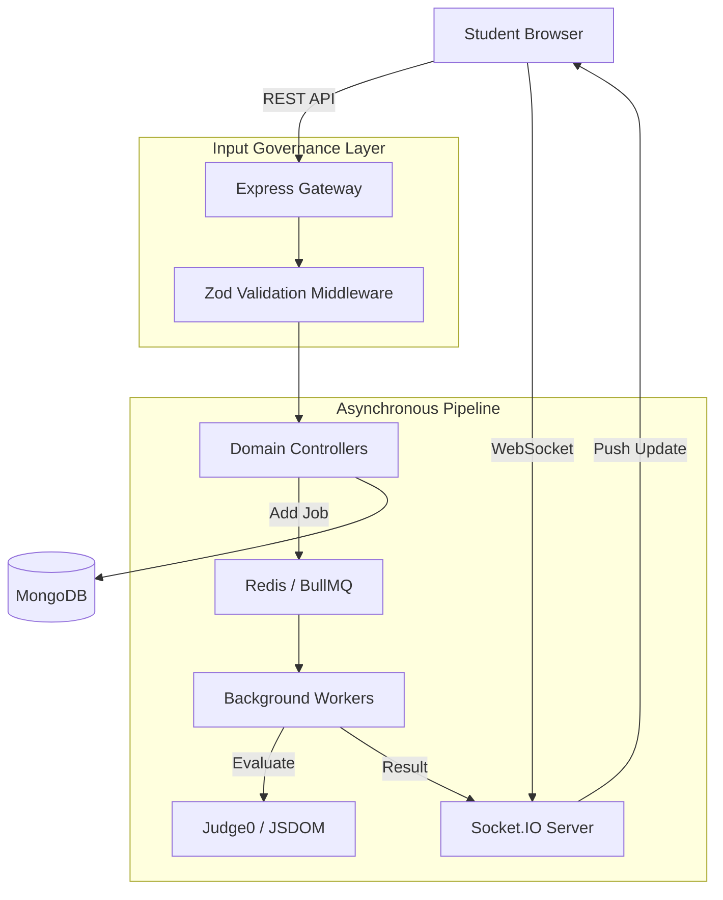
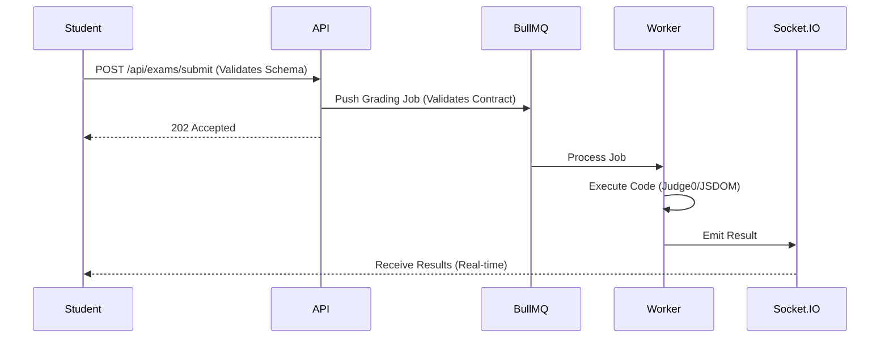

# VISION — Professional AI Exam Governance Platform

VISION is an enterprise-grade, high-integrity examination ecosystem. It combines **Real-time Proctoring**, **Asynchronous Grading Pipelines**, and **Hardened Authentication** to provide a secure environment for high-stakes assessments.

---

## 🏗️ System Architecture



---

## 🔐 Core Engineering Standards

### 1. 🛡️ Input Governance Layer (Zod)
Every request entering the system is strictly validated before reaching the business logic.
- **Strict Mode:** Extra fields are rejected to prevent mass-assignment vulnerabilities.
- **Contract Enforcement:** Queues validate payloads before insertion, ensuring the "Gold Contract" between Controller and Worker is never broken.
- **Global Error Format:** Standardized `VALIDATION_ERROR` responses for frontend consistency.

### 2. 🔑 Hardened Unified Auth
- **Session Versioning:** Every token (Access/Refresh) carries a `sessionVersion`. Incrementing this in the DB acts as a **Global Kill Switch** for all active sessions/sockets.
- **Refresh Token Rotation:** Every refresh issues a new rotating token; reuse attempts trigger proactive account lockdown (Theft Detection).
- **Socket Authentication:** Sockets are authenticated via JWT and strictly monitored for version mismatches.

### 3. 🏗️ Centralized Bootstrap & Lifecycle
The platform follows a linear, dependency-first startup sequence managed by a single orchestrator:
`Environment Check` ➡️ `DB Connect` ➡️ `Redis Connect` ➡️ `Worker Registry` ➡️ `Cache Warmup` ➡️ `Server Listen` ➡️ `Health Monitor`.

---

## 🚦 Data Flows

### Exam Submission & Grading


---

## 🛠️ Tech Stack & Services

- **Backend:** Node.js, Express, MongoDB (Mongoose), Redis.
- **Queuing:** BullMQ (Redis-backed).
- **Validation:** Zod (Strict Governance).
- **Real-time:** Socket.IO (Authenticated).
- **Execution:** Judge0 (Code), Isolated-VM/JSDOM (Frontend Labs).
- **Storage:** Cloudinary (Proctoring Snapshot Vault).

---

## 🚀 Setup & Execution

### Prerequisites
- Node.js 18+
- MongoDB & Redis (Local or Cloud)
- Judge0 API Key (Optional for local development)

### Quick Start
1. **Clone & Install:**
   ```bash
   cd backend && npm install
   cd ../frontend && npm install
   ```
2. **Environment Configuration:**
   Copy `backend/.env.example` to `backend/.env` and fill in required secrets.

3. **Bootstrap Platform:**
   ```bash
   # Start Backend (Linear Lifecycle)
   npm run dev
   
   # Start Frontend
   npm run dev
   ```

4. **Health Check:**
   Visit `http://localhost:5001/health` to verify system readiness.

---

## 🩺 System Health Monitoring
- **`/health`**: Returns system uptime, memory usage, and readiness state.
- **`isReady` Guard**: Signals load balancers to withhold traffic until all background services are fully warmed up.

---

### **Vision: Built for Integrity, Scaled for Excellence.**
